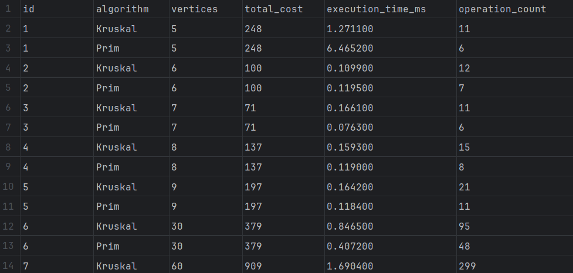
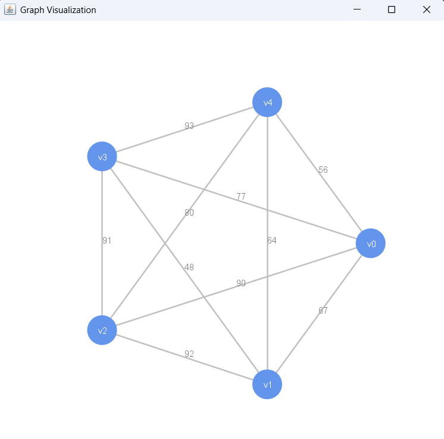

# Assignment 3 — City Transportation Network Optimization (MST)

## 1. Objective
The goal of this project is to apply **Prim’s** and **Kruskal’s** algorithms to determine the **Minimum Spanning Tree (MST)** for a city transportation network.  
The objective is to minimize total construction costs while ensuring all city districts remain connected.

---

## 2. Project Structure
````
src/main/java/org/example/ → Source code
src/main/resources/ → Input/output JSON and CSV
src/test/java/org/example/ → JUnit automated tests
README.md → Report and analysis
````


---

## 3. Input Datasets
- **28 graphs total:**
    - 5 small (5–30 vertices)
    - 10 medium (30–300 vertices)
    - 10 large (300–1000 vertices)
    - 3 extra-large (1000–2000 vertices)
- Each graph is stored in `ass_3_input.json` with:
  ```json
  {
    "id": 1,
    "nodes": ["v0", "v1", "v2", "v3", "v4"],
    "edges": [
      {"from": "v0", "to": "v1", "weight": 67}, ...
    ]
  }

---

## 4. Output and Evaluation
**Program generates two files:**
 - ass_3_output.json → detailed MST results
 - results.csv → summarized metrics for analysis
Each contains:
- Total MST cost
- Execution time (ms)
- Operation count

---

## 5. Example CSV Output


---

## 6. Analysis and Discussion
### **Correctness**
- Both algorithms produce identical total MST costs for every graph.
- MST edge count = V - 1, connected and acyclic.
- Disconnected graphs handled correctly.

### **Performance Comparison**

| Size          | Avg. Vertices | Faster Algorithm   | Comments                                          |
| ------------- | ------------- | ------------------ | ------------------------------------------------- |
| Small (≤30)   | ~10           | **Prim**           | Heap-based selection faster on dense small graphs |
| Medium (≤300) | ~100          | **Prim ≈ Kruskal** | Similar performance                               |
| Large (≤1000) | ~500          | **Kruskal**        | Sorting overhead small, Union-Find efficient      |
| Extra-Large   | ≥1000         | **Kruskal**        | Better scalability due to simpler structure       |

Prim’s algorithm is more efficient for dense graphs (many edges),
while Kruskal’s performs better for sparse large graphs.

### Operation Counts
- Prim performs more key updates and comparisons (priority queue operations).
- Kruskal performs fewer operations overall due to edge sorting once per run.

---

## 7. Conclusions
- Both algorithms yield identical MST costs (correctness validated). 
- Prim’s algorithm is simpler to implement with adjacency lists. 
- Kruskal’s algorithm scales better on large sparse networks. 
- Total execution times remain under milliseconds for small and medium datasets.

---

## 8. Bonus: Graph Design in Java
Implemented custom classes:
- Graph.java — adjacency structure for vertices and edges
- Edge.java — weighted undirected edge

These were fully integrated with both MST algorithms.

And was created class **GraphVisualizer**, for only one visual graph in which each vertex has a connection with all.


